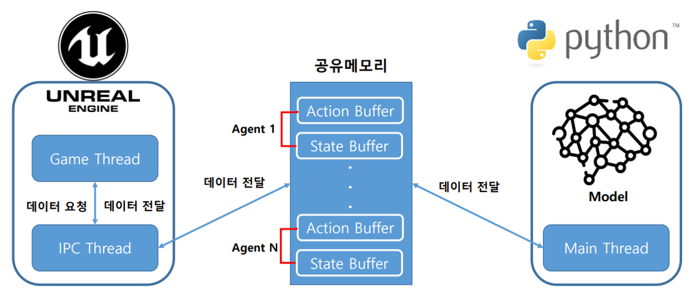

# FindArk
석사 학위 졸업 논문에서 개발한 RPG Gym의 코드 리팩토링, 문제점 개선을 위해 시작한 프로젝트 입니다. 기존 Blueprint 기반의 구현체들을 C++로 바꾸고 주요 로직을 C++ 코드로 구현했습니다. 또한, 이를 상속받아 Blueprint에서는 기본 값, 메쉬 등 그래픽 설정 등 사용하는 입장에서 C++ 코드를 몰라도 사용할 수 있도록 구현했습니다.

### 프로젝트 개요
1. 프로젝트 기간: 2023. 04 ~ 2022. 0.6
2. 개발 도구 및 개발 환경:  
       
3. 참여 인원: 1인
 

### 프로젝트 세부 내용
**1. 캐릭터 구현**
* Blueprint → C++ 구현 (FABaseCharacter)
* 스탯 (FAStatComponent), 스킬 (FASkillComponent)을 액터 컴포넌트로 분리해서 구현
* Blender를 사용해 Paragon 캐릭터의 스켈레톤 구조 변경(Weapon 제거)
* Paragon 애셋 및 애니메이션(Frank Pack)을 사용해 스킬 모션 구현(Anim Retargetting 사용)
 

**2. 스탯, 스킬 컴포넌트 구현**
* 스탯 구성: HP, MP, 공격력, 방어력, 크리티컬 확률, 캐릭터 타입 등을 구조체로 관리 (FCharacterData)
* 스킬 구성: 스킬 고유 번호, 데미지 계수, 쿨타임, 소비 MP, AnimMontange 등을 구조체와 데이터 테이블로 관리(FSkillData, FSkillExtaData)
* 각 데이터는 JSON 파일에서 기본 값을 설정하도록 구현
* 각 데이터는 게임이 시작될 때, GameMode에서 초기화
 

**3. 게임 시스템 구현**
* Game Instance 구현 (C++)
    * 게임을 실행할 때, 캐릭터, 보스 몬스터, 게임 규칙 등 필요한 정보를 JSON 파일에서 파싱
    * 파싱된 데이터는 구조체로 관리
    * FAGameInstance Class
* Game Mode 구현 (C++)
    * 게임이 시작될 때, 캐릭터, 보스 몬스터, 게임 규칙을 Game Instance에서 파싱한 JSON 데이터를 사용해 초기화
    * 게임의 제한 시간, 리셋, 종료 등을 관리
    * IPC 통신 스레드와 공유 메모리 관리
    * FAGameModeBase Class
* 통신 모듈 개선
    * Deep Learning 학습 환경을 로컬 머신으로 한정하고 따라서 로컬 프로세스 통신 중 속도가 빠른 IPC 방법으로 교체. 따라서 기존 UDP 통신에서 IPC 통신(공유 메모리)로 변경해서 구현
    * IPC 통신을 위해 게임 주 스레드(UE의 GameThread)가 아닌 별도의 스레드를 생성하고 해당 스레드에서 Python 프로세스와 통신
    * 통신은 구조체를 직렬화(Serialization) 과정을 거쳐 ByteCode로 변환 후 공유 메모리에 쓰기/읽기를 반복
    * 공유 메모리 오염 방지를 위해 세마포어 방법을 사용해서 언리얼 프로세스와 Python 프로세스의 쓰기/읽기 순서가 섞이지 않도록 구현
    * FAWokerThread
    
    
    * [Show Detail](https://github.com/Tab4Space/FindArk/wiki/IPC-flow)
 

**4. 시뮬레이션 기능 구현**
* Deep Learning 학습에서 매 시뮬레이션마다 파라미터를 수정할 수 있도록 JSON 데이터 파싱 구현 (C++)
* IPC 통신 기능 구현 (C++)
* Deep Learning 학습에는 렌더링이 필요없으므로 Headless 기능 구현
* 시뮬레이션에 소요되는 물리적 시간을 단축하기 위해 가속화 기능 구현
* Deep Learning에서 쉽게 사용할 수 있도록 OpenAI Gymnasium API 구현
 

### 개발 진행 영상
[Playlist (Youtube)](https://www.youtube.com/playlist?list=PLnRVH8DOZjpD25-ojWCmurzCvA9GMnwyE)